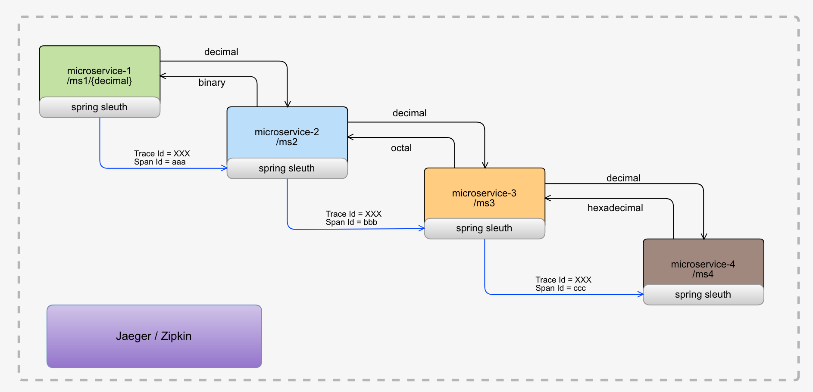
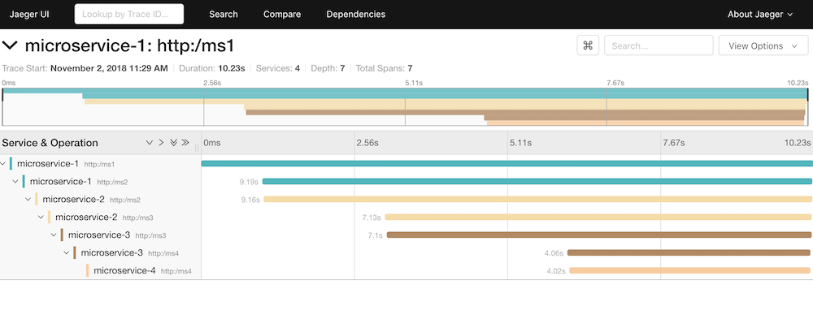
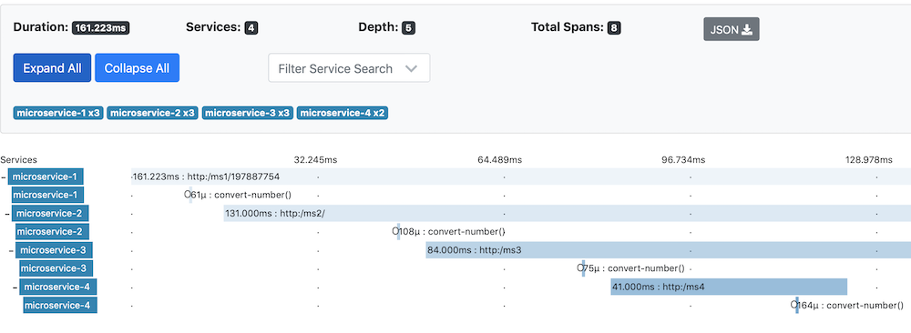

### Traceability with Spring Sleuth

Proof of concept to test the integration between Spring, Zipkin and Jaeger with microservices.



- Spring Boot 2.0.1
- Spring Cloud Finchley.SR2
- Zipkin 
- Jaeger 1.7

#### DOCKER

##### Jaeger

```docker run -d -e COLLECTOR_ZIPKIN_HTTP_PORT=9411   -p 5775:5775/udp   -p 6831:6831/udp   -p 6832:6832/udp   -p 5778:5778   -p 16686:16686   -p 14268:14268   -p 9411:9411   jaegertracing/all-in-one:1.7```

URL: [http://localhost:16686](http://localhost:16686)



##### Zipkin

```docker run -d  -p 9411:9411  openzipkin/zipkin ```

URL: [http://localhost:9411/zipkin](http://localhost:9411/zipkin)



### Spring Cloud Sleuth

https://cloud.spring.io/spring-cloud-sleuth/1.2.x/multi/multi_spring-cloud-sleuth.html
